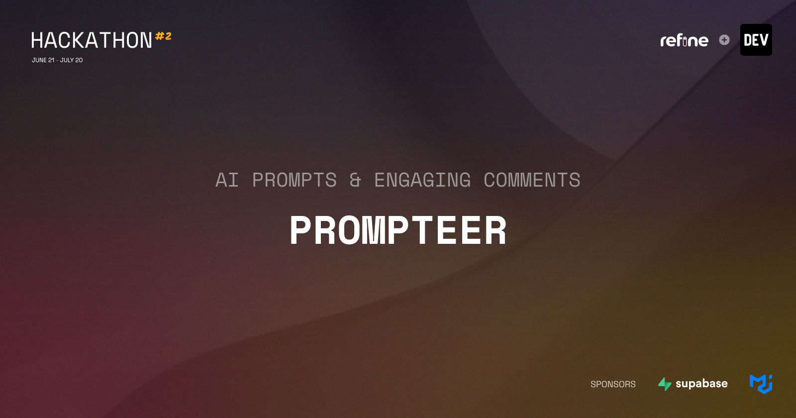

# Prompteer



### 🔗 Project Demo link

https://prompteer.netlify.app/

### 📋 Description

Prompteer is a web app that allows you to share your creative AI prompts and receive feedback through comments, you can also comment on other peoples prompts.

In the Free plan you're allowed to publish prompts containing a title, the prompt itself, choose the AI Model and language written. Upgrading your account the Pro plan unlocks additional fields to write your prompts, such as Parameters and Details.

The app uses OAuth (GitHub or Discord) to sign in new users, and when it's their first sign in, the app automatically creates a stripe customer based on the email from OAuth. After a successful login, the user is presented with a dashboard-like experience provided by the refine framework. Most of the content are built upon the framework so the development went way faster than starting from scratch.

### 👨‍💻 Participants

- Mateus Abelli

### 🖼 Demonstration

<video src=".github/demo.mp4"></video>

### 🧪 Set up Project

First clone the repo then install all of the dependencies as shown in the Install Project section at the bottom.

After having the project properly installed, you're going to need to sign in to a couple services such as Supabase and Stripe, the process will be covered in the next session.

The app will run by default on the following address: http://localhost:3000

### 🧱 Prerequisites

#### Data Layer

- Sign in to [Supabase](https://app.supabase.com/sign-in)

  - Create a new database "Prompteer"
  - Copy your API Key, DB URL (Connection string), and the URL (for REST API)

- Sign in to [Stripe](https://stripe.com)
  - Create a new account "Prompteer"
  - Create a new product "Pro" and copy its Price ID
  - Go to [Api Keys](https://dashboard.stripe.com/test/apikeys) and copy your Publishable Key and Secret
  - Go to [Webhooks](https://dashboard.stripe.com/test/webhooks) and add a local listener. Make sure to copy it's secret when running on the command line.

#### Authentication

- Sign in to [Discord Developer Portal](https://discord.com/developers/applications)

  - Create a new application "Prompteer"
  - Copy your Client ID and Client Secret
  - Set your redirect URL to http://localhost:3000/api/auth/callback/discord

- Sign in to [GitHub](https://github.com/)
  - Create a new [OAuth App](https://github.com/settings/developers) "Prompteer"
  - Copy your Client ID and Client Secret
  - Set your authorization callback URL to http://localhost:3000/api/auth/callback/discord

#### Environment Variables

With all of those services ready, copy the `.env.example` to `.env` and fill the empty entries with the values copied from steps above.

### 📦 Install Project

#### Setup

- Clone the repository:

```
git clone https://github.com/mateusabelli/prompteer.git
```

- Change directory and install dependencies:

```
cd prompteer
npm install
```

#### Commands

- `npx prisma db seed` Use the `seed.ts` script to initiate your database with some data.
- `npm run dev` Start the development server on http://locahost:3000
